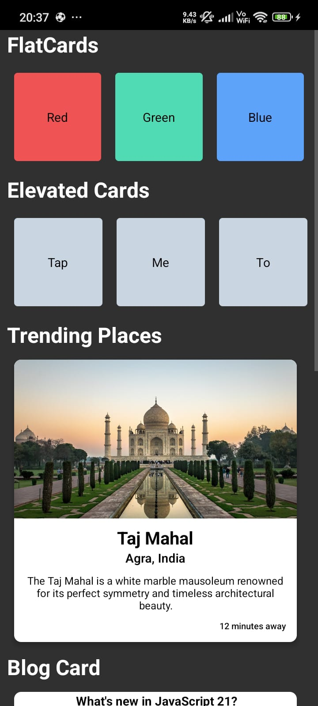

# React Native CLI UI Demo

This project was created to deepen my understanding of the React Native CLI workflow (after previously building a Todo List app using Expo, available on my profile).

## Overview
This is a UI-focused React Native application showcasing different card layouts and common UI patterns without relying on Expo tooling. It helped me understand native project structure, running the app on a physical device, and configuring the environment manually.

## Features
- Built using React Native CLI
- Reusable UI components
- Flat and elevated cards
- Contact list section
- Trending places UI
- Blog card layout

## Tech Stack
- React Native CLI
- JavaScript
- Android (tested)

## Screenshots

<p align="center">
  
  
</p>

> Add your images inside a `screenshots` folder and update paths if needed.

## Getting Started

```bash
git clone https://github.com/yourusername/react-native-cli-ui-demo.git
cd react-native-cli-ui-demo
npm install
npx react-native run-android
